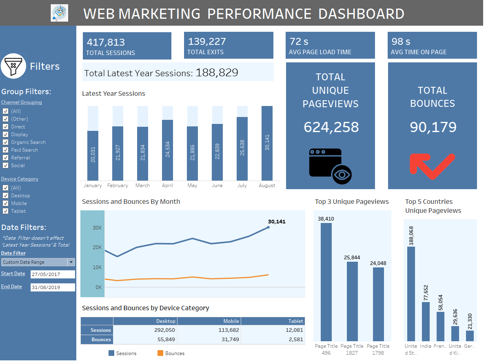

# Tableau Web Marketing Performance Dashboard

**Tools:** Tableau

## Overview

You can see the dashboard directly here: [Tableau Public link](https://public.tableau.com/app/profile/danos.dimitris/viz/WebMarketingDashboard_17243592790950/Dashboard?publish=yes). This repository contains the data for the dashboard. 

The dashboard is designed to provide a comprehensive overview of a website's marketing performance, showcasing key metrics and visualizations to help analyze traffic sources, user behavior, and engagement.

### Goal

The main goal of this dashboard is to help businesses understand their web traffic data effectively. It is a powerful tool for tracking user sessions, page load times, bounce rates, and other critical metrics. By visualizing web marketing data in an interactive format, users can make data-driven decisions to enhance their online presence and user engagement.

### Dashboard Key Features

- Web Traffic Overview
- Sessions and Bounces Analysis by Month and Device
- Top Unique Pageviews and Country Insights



## How to Use the Dashboard

1. **Explore the Dashboard Online**:
   - Access the dashboard directly via this [Tableau Public link](https://public.tableau.com/app/profile/danos.dimitris/viz/WebMarketingDashboard_17243592790950/Dashboard?publish=yes).
   - Utilize the interactive filters to explore different aspects of the web marketing data.
   - Hover over data points to see detailed information and tooltips.

2. **Clone the Repository**:

    ```bash
    git clone https://github.com/D-Danos/Tableau-Web-Marketing-Performance-Dashboard.git
    ```

## Steps

1. **Imported Data**:
   - Imported the provided `.csv` file into Tableau.

2. **Data Preparation**:
   - Data is consistent and valid, with no errors or empty fields.

3. **Creating Filters and Calculations**:
   - Created filters for Channel Grouping, Device Category, and Date Range to allow dynamic data exploration.
   - Calculated key metrics like Total Sessions, Total Exits, Average Page Load Time, Average Time on Page, and Total Bounces.

4. **Calculated Fields for Filters**:

    **Date Filter**  
    - **Role:** Discrete Dimension  
    - **Type:** Calculated Field  
    - **Contains NULL:** No  
    - **Status:** Valid  

    **Formula**:
    ```Tableau
    CASE [Parameters].[Date Filter]
        WHEN 'All Time' THEN [Date] >= {MIN([Date])} AND [Date] <= {MAX([Date])}
        WHEN 'Yesterday' THEN [Date] = DATEADD('day', -1, {MAX([Date])})
        WHEN 'This Week' THEN DATE(DATETRUNC('week', [Date], 'Monday')) = DATE(DATETRUNC('week', {MAX([Date])}, 'Monday'))
        WHEN 'Last Week' THEN DATE(DATETRUNC('week', [Date], 'Monday')) = DATEADD('week', -1, DATE(DATETRUNC('week', {MAX([Date])}, 'Monday')))
        WHEN 'This Month' THEN DATE(DATETRUNC('month', [Date])) = DATE(DATETRUNC('month', {MAX([Date])}))
        WHEN 'Last Month' THEN DATE(DATETRUNC('month', [Date])) = DATEADD('month', -1, DATE(DATETRUNC('month', {MAX([Date])})))
        WHEN 'This Quarter' THEN DATE(DATETRUNC('quarter', [Date])) = DATE(DATETRUNC('quarter', {MAX([Date])}))
        WHEN 'Last Quarter' THEN DATE(DATETRUNC('quarter', [Date])) = DATEADD('quarter', -1, DATE(DATETRUNC('quarter', {MAX([Date])})))
        WHEN 'This Year' THEN DATE(DATETRUNC('year', [Date])) = DATE(DATETRUNC('year', {MAX([Date])}))
        WHEN 'Last 30 Days' THEN [Date] >= DATEADD('day', -30, {MAX([Date])}) AND [Date] <= DATEADD('day', -1, {MAX([Date])})
        WHEN 'Last 60 Days' THEN [Date] >= DATEADD('day', -60, {MAX([Date])}) AND [Date] <= DATEADD('day', -1, {MAX([Date])})
        WHEN 'Last 90 Days' THEN [Date] >= DATEADD('day', -90, {MAX([Date])}) AND [Date] <= DATEADD('day', -1, {MAX([Date])})
        WHEN 'Custom Date Range' THEN [Date] >= [Start Date] AND [Date] <= [End Date]
    END
    ```
    **Domain (2 members):**  
    - False  
    - True  


    **Show Custom Date Filter**  
    - **Role:** Discrete Dimension  
    - **Type:** Calculated Field  
    - **Contains NULL:** No  
    - **Status:** Valid  

    **Formula**:
    ```Tableau
    [Parameters].[Date Filter] = 'Custom Date Range'
    ```
    **Domain (1 member):**  
    - True  

6. **Creating the Dashboard**:
   - Designed the dashboard layout to include key performance indicators (KPIs), bar charts for monthly sessions and bounces, and a geographical breakdown of top countries by unique pageviews.
   - Utilized color coding and tooltips to enhance user experience and interactivity.

## Credits

Credits to [Abhishek Agarrwal](https://www.youtube.com/@AbhishekAgarrwal) for providing the web traffic data and inspiration via their tutorial. This project started as one of his tutorials, then extended it by applying filters and Calculated fields.

## Contact

For any questions or support, please reach out via [LinkedIn](https://www.linkedin.com/in/dimitris-danos).
